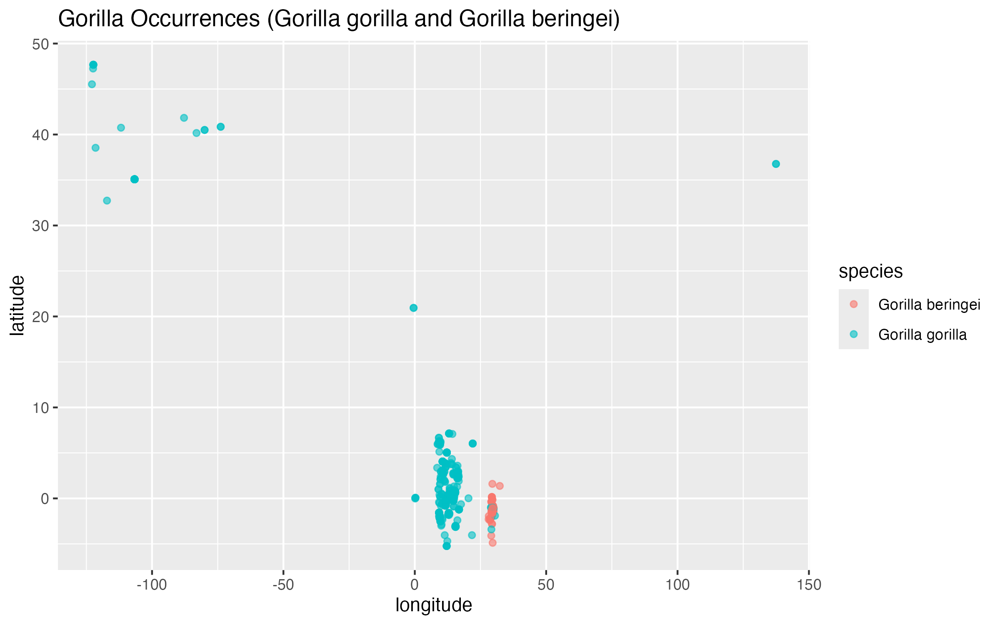
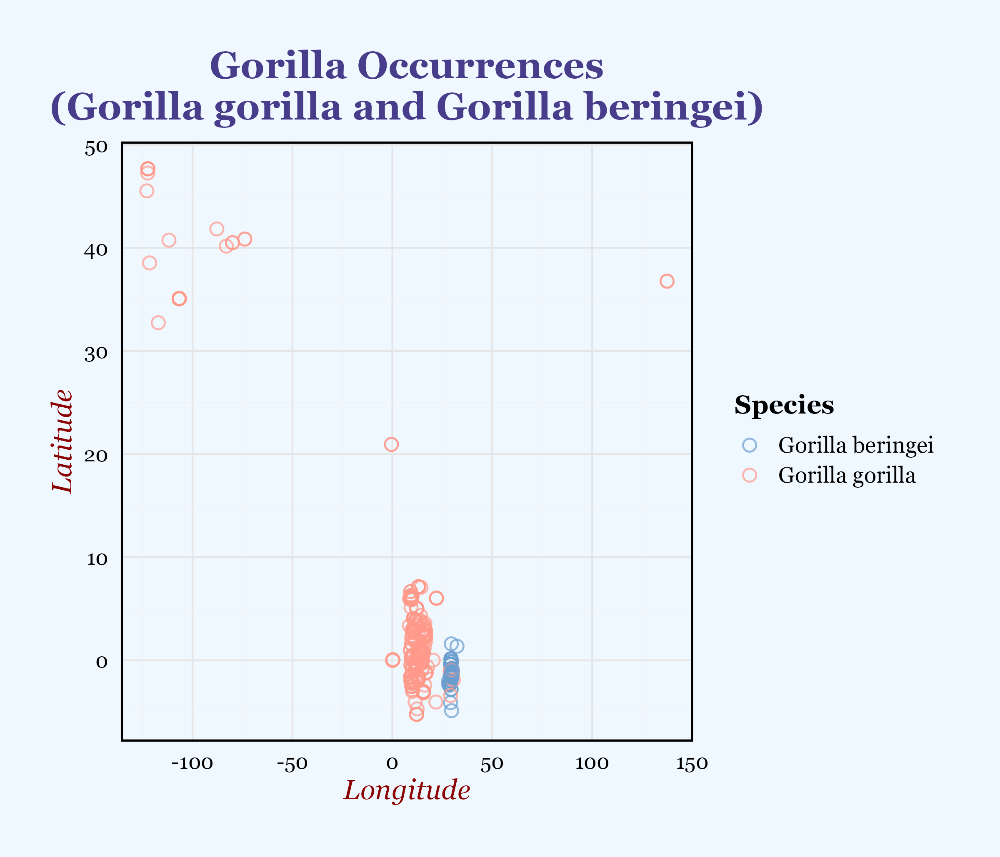
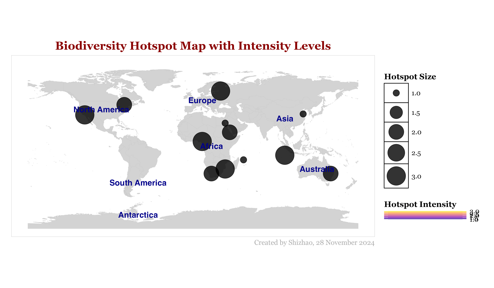

<p align="center" style="display:inline-block; text-align:center; width:100%; margin-right: 10px;">
    
    <br>
    <i style="font-size: 0.9em; text-align: center; display: block;">
      Image showing gorillas in their natural habitat.<br>
      (Source: <a href="https://www.inaturalist.org/photos/415033125" style="color: inherit; text-decoration: none;">miquelpaniscus, iNaturalist</a>)<br>
      Creator: miquelpaniscus (licensed under <a href="http://creativecommons.org/licenses/by-nc/4.0/" style="color: inherit; text-decoration: none;">CC BY-NC 4.0</a>)
    </i>
</p>

## Biodiversity Hotspot Mapping

### Tutorial Aims

##### 1. Understand the variety of functions in the `dplyr` package and its application to biodiversity data.

##### 2. Learn to creatively combine and manipulate biodiversity tables and spatial data.

##### 3. Become efficient and creative in manipulating species occurrence data and environmental variables.


### Tutorial Steps

##### <a href="#section1">Introduction</a>
- <a href="#section2">Prerequisites</a>
- <a href="#section3">Data and Materials</a>

##### <a href="#section4">PART I: Data Inspection and Cleaning</a>
- <a href="#section5">Load and Inspect Data</a>
- <a href="#section6">Clean the Data</a>
- <a href="#section7">Check for Duplicates</a>

##### <a href="#section8">PART II: Geospatial Data Analysis</a>
- <a href="#section9">Visualize Species Occurrence</a>
- <a href="#section10">Perform Kernel Density Estimation (KDE)</a>
- <a href="#section11">KNN for Nearest Neighbor Analysis</a>

##### <a href="#section12">Part III: Visualizing the Biodiversity Hotspot Map</a>
- <a href="#section13">Create a Static Hotspot Map</a>
- <a href="#section14">Create an Interactive Map with Leaflet</a>


##### <a href="#section15">Challenges
- <a href="#section16">Modify KDE: Experiment with adjusting the smoothing parameter (sigma) in KDE to see how it affects hotspot identification.</a>
- <a href="#section17">Add a New Species: Use a different species (e.g., Panthera leo) and compare the hotspots for that species with the gorillas.</a>
- <a href="#section18">Environmental Data: Simulate environmental data (e.g., precipitation) and incorporate it into the hotspot analysis.</a>
- <a href="#section19">Enhance the Interactive Map: Add more details in the interactive map, such as the number of species per hotspot and additional metadata.</a>


---------------------------
### <a name="section1">Introduction</a>

Biodiversity hotspot mapping is the process of identifying areas on Earth that are particularly rich in species diversity and are under threat from human activities. These hotspots are often characterized by high levels of unique species found nowhere else, making them critical for conservation efforts. Mapping these areas allows us to prioritize regions for protection and sustainable management.

In this tutorial, we focus on how to map biodiversity hotspots using species occurrence data and environmental factors. We start by retrieving data on species, such as the gorilla, from sources like the [Global Biodiversity Information Facility (GBIF)](https://www.gbif.org/zh/), which provides information on where different species are found.

By visualizing the occurrence of species over environmental factors, we can identify areas where species thrive. This can help us understand the relationship between species distribution and the environment. You'll learn how to handle and visualize biodiversity data in `R` using the `dplyr` package for data manipulation, and spatial analysis techniques with `ggplot2` and `raster` to create informative maps.

The goal of biodiversity hotspot mapping is not just to show where species live, but to inform conservation strategies by focusing attention on areas that need protection the most. This process ultimately helps in preserving our planet’s most vulnerable ecosystems and species.


<p align="center" style="display:inline-block; text-align:center; width:100%; margin-right: 10px;">
    
    <br>
    <i style="font-size: 0.9em; text-align: center; display: block;">
      Map showing global biodiversity hotspots (Weller et al. 2014).<br>
      (Source: <a href="https://atlas-for-the-end-of-the-world.com/world_maps/world_maps_biological_hotspots.html" style="color: inherit; text-decoration: none;">ATLAS for the END of the WORLD</a>)
    </i>
</p>


#### <a name="section2">Prerequisites</a>

This tutorial is suitable for those with a basic understanding of data manipulation and visualization in `R`. We will cover concepts ranging from basic data cleaning and transformation with `dplyr`, to more advanced spatial analysis with `ggplot2` and `raster`. To make the most of this tutorial, you should be familiar with:

- Data manipulation using `dplyr` and `tidyr`
- Data visualization with `ggplot2`

If you're new to these topics or need a refresher, there are excellent resources available on the Coding Club website:

[Getting started with R and RStudio](https://ourcodingclub.github.io/tutorials/intro-to-r/)

[Basic data manipulation](https://ourcodingclub.github.io/tutorials/data-manip-intro/)

[Beautiful and informative data visualisation](https://ourcodingclub.github.io/tutorials/datavis/)


#### <a name="section3">Data and Materials</a>

You can find all the data that you require for completing this tutorial on this [GitHub repository](https://github.com/EdDataScienceEES/tutorial-xiongshizhao). We encourage you to download the data to your computer and work through the examples throughout the tutorial as this will reinforces your understanding of the concepts taught in the tutorial.

**Now, let's get started!**


### <a name="section4">PART I: Data Inspection and Cleaning</a>
#### <a name="section5">Load and Inspect Data</a>

Begin by setting up a new R script. At the very top, include a few lines to introduce the project, such as your name, the date, and a brief description. When going through the tutorial, copy the individual code chunks and paste them to your script. Use hash symbol `#` when adding comments.

```r
# Biodiversity Hotspot
# Author: Your Name
# Date: DD/MM/YYYY
```

Setting the working directory, install and load libraries of all packages required for this tutorial.

```r
# Set working directory to where you saved the folder with tutorial materials on your computer
setwd("your_filepath")

# Load necessary libraries
# Uncomment the following lines to install the required packages if not already installed
# install.packages("dplyr")
# install.packages("ggplot2")

# Load required libraries
install.packages("dplyr")
install.packages("ggplot2")

# Load the gorilla occurrence data
gorilla <- read.csv("data/gorilla.csv")
```

Before start our work like visual or even our final goal-hotspot, we need to inspect the dataset to understand its structure and identify potential issues.

```r
# Inspect the dataset to understand its structure and identify potential issues
summary(gorilla)
```

#### <a name="section6">Clean the Data</a>

After inspecting the brief features of our data, we found that there are NAs, but we don't want to remove all of them. If we do, there may be very little data left, so we will only focus on removing the NAs that may affect our subsequent graphing and mapping.

Next, let's handle missing data, and ensure no empty species entries.

```r
# Remove rows with empty species names and check for missing data
gorilla_data_clean <- gorilla_data %>%
  filter(species != "") %>%
  filter(!is.na(species), !is.na(decimalLatitude), !is.na(decimalLongitude))

# Rename the column 'decimalLongitude' to 'longitude' and 'decimalLatitude' to 'latitude'
gorilla_data_clean <- gorilla_data_clean %>%
  rename(longitude = decimalLongitude, latitude = decimalLatitude)

# Verify the updated column names
colnames(gorilla_data_clean)
```

Remember, the technique of combining two separate blocks of code into one involves chaining operations together with the pipe operator `%>%`, a key feature of the `dplyr` package in `R`.

We can apply this to reduce redundancy. Try the code below—it looks better, right? You can keep the following code and delete the one previously used for data cleaning.

```r
# Clean the dataset
gorilla_clean <- gorilla %>%
  # Remove rows with empty or missing species names and coordinates
  filter(!is.na(species) & species != "") %>%
  filter(!is.na(decimalLatitude) & !is.na(decimalLongitude)) %>%
  # Rename columns for consistency and simplicity
  rename(
    longitude = decimalLongitude,
    latitude = decimalLatitude
  )

# Validate the cleaned data
# Check for duplicate rows
gorilla_clean <- gorilla_clean %>%
  distinct()

# Summarize the cleaned dataset to verify the cleaning process
glimpse(gorilla_clean)
summary(gorilla_clean)

# Check the first few rows of the cleaned data for a quick inspection
head(gorilla_clean)
```

You may also want to save the cleaned data for future use.
```r
# Optional
write.csv(gorilla_clean, "data/gorilla_clean.csv")
```

#### <a name="section7">Check for Duplicates</a>

Notice that we used the `glimpse` function above. We can see that although we focus on gorillas, there are more specific species under the gorilla genus: ***Gorilla gorilla*** and ***Gorilla beringei***. We will use an r command to help us print out this result manually.

```r
# Get the unique species
unique_species_list <- gorilla_clean %>%
  distinct(species) %>%  # Select unique species from the dataset
  pull(species)          # Extract the unique species as a vector

# Display the number of unique species in the dataset
cat("Number of unique species in the dataset:", length(unique_species_list), "\n")

# Display the list of unique species
cat("Unique species in the dataset:\n")
print(unique_species_list)
```

If you get the same results as I did, you are correct!

```r
> # Display the number of unique species in the dataset
> cat("Number of unique species in the dataset:", length(unique_species_list), "\n")
Number of unique species in the dataset: 2 
```

```r
> # Display the list of unique species
> cat("Unique species in the dataset:\n")
Unique species in the dataset:
> print(unique_species_list)
[1] "Gorilla beringei" "Gorilla gorilla" 
```


### <a name="section8">PART II: Geospatial Data Analysis</a>

#### <a name="section9">Visualize Species Occurrence</a>

This section focuses on visualizing the occurrence of two gorilla species, ***Gorilla gorilla (Western Gorilla)*** and ***Gorilla beringei (Eastern Gorilla)***, based on their geographic coordinates (longitude and latitude).

```r
# Plotting the occurrences of both species
plot <- ggplot(gorilla_clean, aes(x = longitude, y = latitude, color = species)) +
  geom_point(alpha = 0.6) +
  ggtitle("Gorilla Occurrences (Gorilla gorilla and Gorilla beringei)")
```

Remember what we learn from [Beautiful and informative data visualisation](https://ourcodingclub.github.io/tutorials/datavis/), You may want to add more details to make your visual even more beautiful!

Below is my graph. Show me yours! Don't forget to install the new packages for graphing.

```r
# Install packages
install.packages("RColorBrewer")
install.packages("extrafont")

# Load additional libraries
library(RColorBrewer)
library(extrafont)

# Create a ggplot for visualizing the gorilla occurrence data
beautifulplot <- ggplot(gorilla_clean, aes(x = longitude, y = latitude, color = species)) +
  geom_point(alpha = 0.7, size = 3, shape = 21, stroke = 0.8) +  # Slightly larger, more defined points
  scale_color_manual(values = c("Gorilla gorilla" = "#FF9A8B",
                                "Gorilla beringei" = "#6A9ECF")) +
  labs(
    title = "Gorilla Occurrences\n(Gorilla gorilla and Gorilla beringei)",  # Title
    x = "Longitude",
    y = "Latitude",
    color = "Species"
  ) +
  theme_minimal(base_size = 16) +  # Base size for readability
  theme(
    plot.title = element_text(family = "Georgia", hjust = 0.5, size = 22, color = "darkslateblue", face = "bold"),  # Fancy script title with Lobster font
    axis.title = element_text(family = "Georgia", size = 16, face = "italic", color = "darkred"),  # Elegant font for axis titles
    axis.text = element_text(size = 12, family = "Georgia", color = "black"),  # Readable axis text
    legend.position = "right",  # Legend on the right
    legend.title = element_text(size = 15, family = "Georgia", face = "bold"),  # Bold legend title
    legend.text = element_text(size = 13, family = "Georgia"),  # Font size for legend
    panel.grid.major = element_line(color = "gray90", size = 0.5),  # Light major grid lines
    panel.grid.minor = element_line(color = "gray95", size = 0.25),  # Even lighter minor grid lines
    panel.border = element_rect(color = "black", fill = NA, size = 1.2),  # Plot border
    plot.margin = margin(50, 50, 50, 50),  # Balance the margins
    plot.background = element_rect(fill = "aliceblue", color = NA)  # Soft background color
  )
```

Whatever you create from the data, don't forget to make an 'outputs' folder to save them. Make it a good habit for organizing well.

```r
# Save the plots
ggsave("outputs/gorilla_plot.png", plot = plot, width = 6, height = 4, dpi = 300)
ggsave("outputs/gorilla_beautifulplot.png", plot = beautifulplot, width = 6, height = 4, dpi = 300)
```

Below are the two plots I created. Feel free to share your own! You may also want to discuss with your classmates how you created these graphs, what differences you notice between them, what factors contribute to these differences, and what steps you can take to create more visually appealing plots.

<p align="center" style="display:inline-block; text-align:center; width:100%; margin-right: 10px;">
    
    <br>
</p>

<p align="center" style="display:inline-block; text-align:center; width:100%; margin-right: 10px;">
    
    <br>
</p>

#### <a name="section10">Perform Kernel Density Estimation (KDE)</a>
##### Kernel Density Estimation (KDE)</a>

KDE is a statistical method used to estimate the probability density function (PDF) of a continuous random variable. In simpler terms, it helps us understand the distribution of species occurrences across a given geographic area.

##### Purpose of KDE in Biodiversity Hotspot Mapping</a>

When we have data points (such as species occurrences marked by longitude and latitude) scattered across a geographical region, we may want to see the concentration of those occurrences in certain areas. KDE smooths out these data points into a continuous surface, which shows the density of occurrences across the area.

For example, KDE helps us visualize where species are most concentrated in a given geographic region. In the context of biodiversity hotspots:

- Areas with high density will indicate regions where the species is most frequently found, making them potential hotspots.
- Areas with low density will represent regions with fewer species occurrences.

```r
# Install additional packages
install.packages("spatstat")
install.packages('viridis')
install.packages("sp")
install.packages("ks") 

# Load necessary libraries
library(spatstat)
library(viridis)
library(sp)
library(ks)

# Extract the grid coordinates and the density estimates
x_coords <- kde_result$eval.points[[1]]  # Longitude grid points
y_coords <- kde_result$eval.points[[2]]  # Latitude grid points

# Create a grid of coordinates using expand.grid() to match the KDE grid
grid_coords <- expand.grid(x = x_coords, y = y_coords)

# Reshape the KDE estimates into a vector for each coordinate
density_values <- as.vector(kde_result$estimate)

# Create the data frame for visualization
kde_data <- data.frame(
  x = grid_coords$x,
  y = grid_coords$y,
  density = density_values
)

# Visualize the KDE result using ggplot2
kde_plot <- ggplot(kde_data, aes(x = x, y = y, fill = density)) +
  geom_tile() +
  scale_fill_viridis_c() +  # Use a color scale for density
  ggtitle("Kernel Density Estimation of Gorilla Occurrences") +
  labs(x = "Longitude", y = "Latitude", fill = "Density") +
  theme_minimal()

# Save the plot
ggsave("outputs/kdeplot.png", plot = kde_plot, width = 8, height = 5, dpi = 300)
```

<p align="center" style="display:inline-block; text-align:center; width:100%; margin-right: 10px;">
    
    <br>
</p>

I understand that this plot might be a bit difficult to interpret because our dataset is small, and the longitude and latitude values are spread over a large area. This is an important point because when data points are sparse and distributed over a wide geographical range, the density estimates can appear less focused and harder to visualize. The wide distribution of coordinates causes the density values to be spread out, making it harder to identify clear hotspots.

Even though the data is sparse, the KDE is still being used to smooth out the occurrences. However, because of the large geographical area and small number of data points, it's challenging to pinpoint clear areas of concentration. Adjusting smoothing parameters, color contrast, and tile size in the plot can help make the concentration of occurrences more noticeable.


#### <a name="section11">KNN for Nearest Neighbor Analysis</a>
##### K-Nearest Neighbors (KNN)</a>

K-Nearest Neighbors (KNN) is a spatial analysis technique used to measure the distance between each point and its nearest neighbors in a dataset. In ecological terms, this method can be used to understand the clustering or dispersion of species occurrences across a geographical area.

#####  Purpose of KNN in Biodiversity Hotspot Mapping</a>

While Kernel Density Estimation (KDE) provides a density surface that helps us identify areas of high and low species concentration, KNN adds another layer of understanding by quantifying spatial relationships between individual data points. This can help us evaluate the degree of clustering of species occurrences and detect spatial patterns that might not be immediately obvious through KDE alone.

In the context of biodiversity hotspots:

- Clustered Occurrences: If species occurrences are closely grouped together, KNN will reveal spatial clustering, suggesting that certain areas may be biodiversity hotspots. This is useful for identifying regions where the species is most likely to be concentrated or where critical habitat may exist.
- Dispersed Occurrences: If species occurrences are widely dispersed, KNN will indicate spatial dispersion, highlighting areas where the species is spread out across a larger region. This information is important for understanding the spread of species and potential corridors for movement or migration.

```r
# Create a point pattern object
coords <- cbind(gorilla_clean$longitude, gorilla_clean$latitude)
pp <- ppp(coords[, 1], coords[, 2], window = owin(xrange = range(coords[, 1]), yrange = range(coords[, 2])))

# Calculate the nearest neighbor distance
nnd <- nndist(pp)

# Plot histogram of nearest neighbor distances
nndplot <- ggplot(data.frame(nnd), aes(x = nnd)) +
  geom_histogram(binwidth = 0.1, fill = "blue", alpha = 0.7) +
  ggtitle("Nearest Neighbor Distance Distribution") +
  xlab("Distance to Nearest Neighbor") +
  ylab("Frequency") +
  theme_minimal(base_size = 14) +  # Larger font size for readability
  theme(
    panel.background = element_rect(fill = "lightgray"), 
    plot.background = element_rect(fill = "white"),
    plot.title = element_text(hjust = 0.5), 
    axis.text = element_text(color = "black"),
    axis.title = element_text(color = "black"),
    plot.margin = margin(40, 40, 40, 40)
  )

# Save the plot
ggsave("outputs/nndplot.png", plot = nndplot, width = 8, height = 5, dpi = 300)
```
<p align="center" style="display:inline-block; text-align:center; width:100%; margin-right: 10px;">
    
    <br>
</p>


### <a name="section12">Part III: Visualizing the Biodiversity Hotspot Map</a>
#### <a name="section13">Create a Static Hotspot Map</a>

In this step, we will first install and load several important R packages that will help us map and analyze biodiversity hotspots. These packages include:

- `sf`: This package is used for handling spatial data and geometric operations, which is essential for working with map data such as coordinates and boundaries.
- `rnaturalearth` and `rnaturalearthdata`: These packages provide access to global geographic data, such as countries, regions, and continents. We'll use them to get the map features we need to overlay our hotspot data.
- `leaflet`: This package allows us to create interactive maps in R, which will help us visualize the biodiversity hotspots in an engaging way. It makes it easy to add layers and features to maps, such as markers and popups.
- `viridis`: This package provides color scales that are optimized for maps and visualizations. It helps us create visually appealing maps by using perceptually uniform color palettes.

Once the packages are installed, we will define the hotspot data, including longitude and latitude coordinates, as well as the intensity levels of the hotspots, which will be used to visualize them on the map.

```r
# Install and load necessary packages
packages <- c('sf', 'rnaturalearth', 'rnaturalearthdata', 'leaflet', 'viridis')
install.packages(packages)
lapply(packages, library, character.only = TRUE)

# Define hotspot data
hotspot_data <- data.frame(
  longitude = c(-118, -75, 35, 20, 120, 10, 150, 35, 30, 40, 55, 100),  # Longitude values
  latitude = c(34, 45, -25, -30, 35, 5, -30, 25, 60, 15, -15, -10),  # Latitude values
  hotspot_level = c(3, 2, 3, 2, 1, 3, 2, 1, 3, 2, 1, 3)  # Intensity levels
)

# Convert to sf object (spatial data)
hotspot_sf <- st_as_sf(hotspot_data, coords = c("longitude", "latitude"), crs = 4326)

# Load world map data
world_map <- ne_countries(scale = "medium", returnclass = "sf")

# Continent labels
continent_labels <- data.frame(
  label = c("North America", "South America", "Europe", "Africa", "Asia", "Australia", "Antarctica"),
  longitude = c(-100, -60, 10, 20, 100, 135, -60),
  latitude = c(40, -40, 50, 0, 30, -25, -75)
)

# Create the static map with hotspots
ggplot() +
  geom_sf(data = world_map, fill = "lightgray", color = "gray80", size = 0.5) +
  geom_sf(data = hotspot_sf, aes(fill = hotspot_level, size = hotspot_level), color = "black", alpha = 0.8) +
  scale_fill_viridis(option = "C", direction = 1, alpha = 0.7) +
  scale_size_continuous(range = c(5, 15)) +
  geom_text(data = continent_labels, aes(x = longitude, y = latitude, label = label), size = 5, fontface = "bold", color = "darkblue") +
  ggtitle("Biodiversity Hotspot Map with Intensity Levels") +
  labs(caption = "Created by Shizhao, 28 November 2024") +
  theme_minimal() +
  theme(
    axis.text = element_blank(),
    axis.title = element_blank(),
    panel.grid = element_blank(),
    plot.title = element_text(size = 20, face = "bold", hjust = 0.5, color = "darkred", family = "Georgia"),
    plot.caption = element_text(hjust = 1, size = 12, color = "darkgray", family = "Georgia"),
    plot.margin = margin(20, 20, 20, 20),
    panel.background = element_rect(fill = "white", color = "gray", size = 0.3),
    legend.position = "right",
    legend.title = element_text(size = 14, face = "bold", family = "Georgia"),
    legend.text = element_text(size = 12, family = "Georgia"),
    legend.key.size = unit(1.2, "cm"),
    legend.key = element_rect(fill = "white", color = "black", size = 0.5)
  ) +
  coord_sf(xlim = c(-180, 180), ylim = c(-90, 90)) +
  guides(fill = guide_colorbar(title = "Hotspot Intensity", barwidth = 10, barheight = 1),
         size = guide_legend(title = "Hotspot Size"))

# Save the plot as jpeg
ggsave("outputs/hotspot_map.jpeg", width = 12, height = 7, dpi = 300)
```
Here is the plot I created. Do you have any ideas on how to make the plot more beautiful? Think creatively and consider different ways to enhance the design, color scheme, or layout to improve its overall impact.

<p align="center" style="display:inline-block; text-align:center; width:100%; margin-right: 10px;">
    
    <br>
</p>

#### <a name="section14">Create an Interactive Map with Leaflet</a>

Next, we will create an interactive map that allows you to zoom in and out, making it much easier to explore different areas! Isn't that amazing? Just imagine being able to focus on the details of specific regions with just a click or scroll. Are you excited to try this out? It might sound complex at first, but the method we'll use to create this functionality is actually much simpler than you might think! With just a few steps, we’ll bring this interactive feature to life, and you'll see how easy it can be!

To create an interactive hotspot map, start by using the `leaflet` package to plot the map with your hotspot data, which includes coordinates and hotspot levels. Begin by adding the map tiles with `addTiles()` and then use `addCircleMarkers(`) to plot each hotspot as a circle, with its size proportional to the hotspot level and color from the `viridis` palette. Set the map's initial view with `setView()` to center it on coordinates (0,0) and a zoom level of 2. Finally, save the interactive map as an HTML file with `saveWidget()`, allowing you to view it in a browser!

```r
# Create an Interactive Map with Leaflet
leaflet(hotspot_data) %>%
  addTiles() %>%
  addCircleMarkers(
    ~longitude, ~latitude,
    radius = ~hotspot_level * 2,
    color = ~viridis::viridis(1)[1],
    fillOpacity = 0.7,
    popup = ~paste("Hotspot Level: ", hotspot_level)
  ) %>%
  setView(lng = 0, lat = 0, zoom = 2)

# Save the interactive map as an HTML file
library(htmlwidgets)
saveWidget(leaflet(hotspot_data), "outputs/interactive_hotspot_map.html")
```
<p align="center" style="display:inline-block; text-align:center; width:100%; margin-right: 10px;">
  <iframe src="outputs/interactive_hotspot_map.html" width="100%" height="600px" frameborder="0" style="display:block; margin: 0 auto;">
  </iframe>
  <br>
</p>


<hr>

##### Congratulations! 🎉 You complete this entire tutorial!#####

##### By completing this tutorial, I believe you will be competent in:#####
- **Data Cleaning**: Handling and preparing datasets for analysis.
- **Geospatial Visualization**: Plotting and customizing maps to represent spatial data.
- **Kernel Density Estimation (KDE)**: Estimating and visualizing spatial distributions.
- **Spatial Analysis**: Conducting nearest neighbor analysis to study species clustering.
- **Interactive Mapping**: Creating zoomable maps with leaflet for dynamic data exploration.


<hr>

#### If you have any questions about completing this tutorial, please contact me on s.xiong-8@sms.ed.ac.uk

#### We would love to hear your feedback on the tutorial, whether you did it in the classroom or online!</a>

### &nbsp;&nbsp;Subscribe to our mailing list:
<div class="container">
	<div class="block">
        <!-- subscribe form start -->
		<div class="form-group">
			<form action="https://getsimpleform.com/messages?form_api_token=de1ba2f2f947822946fb6e835437ec78" method="post">
			<div class="form-group">
				<input type='text' class="form-control" name='Email' placeholder="Email" required/>
			</div>
			<div>
                        	<button class="btn btn-default" type='submit'>Subscribe</button>
                    	</div>
                	</form>
		</div>
	</div>
</div>
